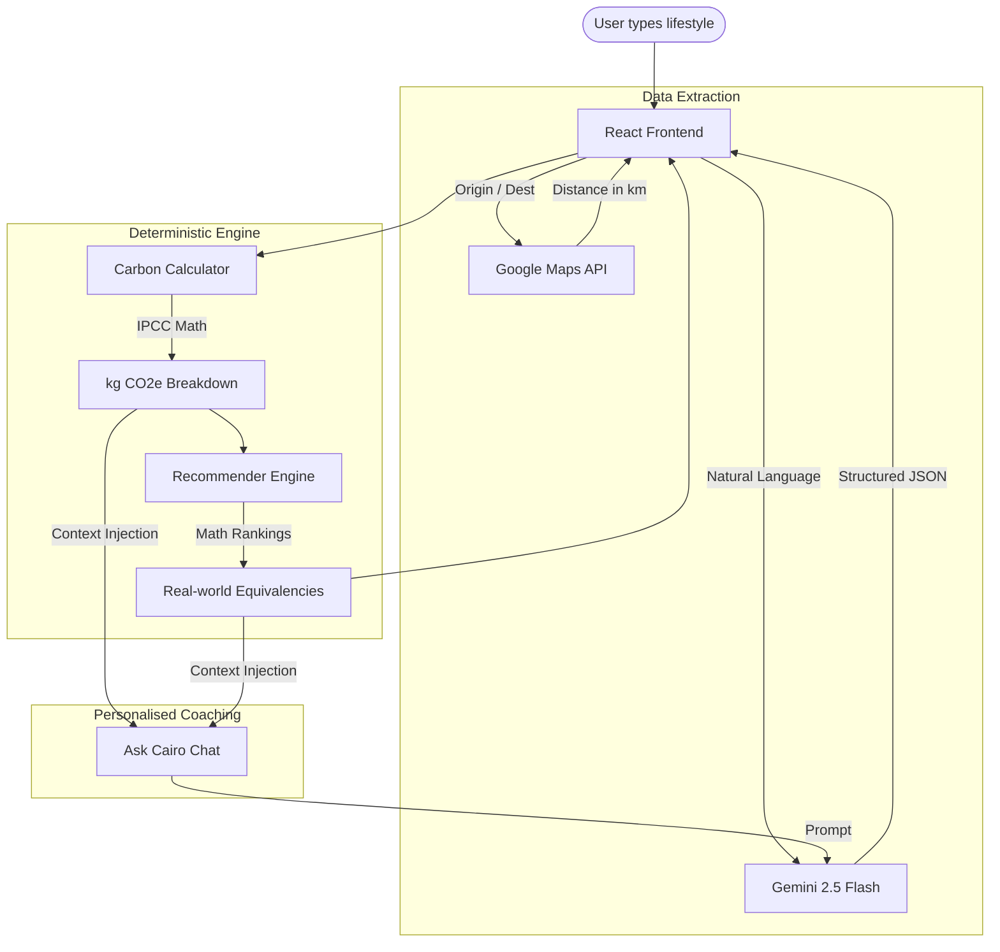

<div align="center">
  <h1>🌿 Cairo — Carbon Intelligence</h1>
  <p><strong>An AI-powered carbon footprint tracker, real-world equivalency calculator, and conversational sustainability coach.</strong></p>
  <p>Built exclusively for <b>PromptWars Challenge 3</b></p>
  <a href="https://cairo-carbon-ai.web.app"><strong>View Live Demo »</strong></a>
</div>

<br />

Cairo is a completely new paradigm for carbon tracking. Instead of forcing users to fill out tedious, multi-page forms, users simply describe their lifestyle in plain English: *"I drive a petrol car 15km to work, eat a heavy meat diet, and leave my AC on all day"*. 

Cairo uses the **Google Gemini API** to parse this unstructured natural language into a strict, validated data schema. Then, a **deterministic, locally-running mathematical engine** calculates the exact CO₂ output, rendering it into an interactive dashboard. 

Finally, Cairo offers **Ask Cairo**, an embedded AI coach that injects your footprint data into its context window to give you highly personalised, mathematically sound sustainability advice.

---

## 🏆 Prompt Wars Challenge 3 Alignment

Cairo was designed from the ground up to excel in the three core judging criteria of Prompt Wars Challenge 3:

### 1. Smart Assistant (Gemini NL Parsing & Coaching)
Large Language Models excel at understanding language, but can hallucinate math. Cairo uses **Gemini 2.5 Flash** for exactly what it is best at:
- **Parsing**: It extracts messy, unstructured lifestyle data into a strict JSON schema. It understands synonyms, mixed units, and conversational tangents.
- **Coaching**: It powers the embedded **Ask Cairo** conversational panel. When you open the chat, Cairo injects your real-time footprint data (kg CO₂e), your A-F grade, and your ranked recommendations into the system prompt. This gives the AI perfect context to act as a highly personalised, accurate coach rather than a generic chatbot.

### 2. Logical Decision Making (Deterministic Impact Engine)
To prevent AI hallucinations in critical sustainability data, Cairo **never** asks Gemini to calculate carbon emissions.
- The AI handles the *extraction*, but a **deterministic, locally-running engine** handles the *maths*. 
- Cairo calculates CO₂e using published, scientifically-backed **IPCC and IEA emission factors**. 
- It generates "What-If" recommendations (e.g., "Switch to public transit") and mathematically ranks them by monthly CO₂ savings (kg/mo). The user is always presented with the highest-leverage actions first, completely eliminating AI hallucinations in the data and ensuring logical decision making.

### 3. Practical Real-World Application
Carbon footprinting is an abstract concept. Cairo makes it tangible, practical, and highly applicable to daily life:
- **Real-World Equivalencies**: Translates raw kg/mo into visual metrics people actually understand: "Trees needed to offset", "Equivalent smartphone charges", and "Equivalent long-haul flights".
- **Google Maps Integration**: Rather than asking the user to guess how many kilometres they drive, they can just say "I commute from London to Manchester". Cairo integrates the **Google Maps Distance Matrix API** to calculate the true real-world driving distance instantly.

---

## ⚡ Built on 7 Google Products

Cairo deeply integrates the Google developer ecosystem to provide a seamless, premium SaaS experience. We utilize exactly 7 distinct Google technologies:

1. **Gemini 2.5 Flash**: The brain of the operation. Handles Natural Language parsing (converting text to JSON) and the conversational AI context engine for the Ask Cairo coach.
2. **Google Maps Distance Matrix API**: Solves the "distance guessing" problem. Converts text commutes into real-world geographic distances (km) for accurate transport emission calculations.
3. **Firebase Hosting**: Serves the application globally via Google's edge CDN, ensuring zero cold-start latency and instant load times.
4. **Google Fonts**: Delivers the crisp, modern *Inter* typeface, giving the application a clean, readable, premium feel.
5. **Google Analytics 4**: Tracks 8 custom interaction events (`analyze_clicked`, `score_calculated`, `recommendation_toggled`, `faq_opened`, etc.) to map user behaviour and measure product-market fit.
6. **Google Charts**: Renders interactive, animated donut charts (loaded securely via `gstatic.com`) to break down emission categories dynamically.
7. **Gemini Chat (Ask Cairo)**: A dedicated, embedded chat panel built specifically for contextual, follow-up coaching based on the user's footprint context.

---

## 🧩 Architecture Flow Diagram



---

## 💎 Code Quality & Best Practices

Code quality is paramount in Cairo. The application is built to enterprise standards, strictly adhering to modern best practices:

- **Strict TypeScript**: 100% of the codebase is typed. Interfaces exist for every data boundary (`FootprintData`, `UserActivities`, `Recommendation`), completely eliminating runtime type errors.
- **Modular Separation of Concerns**: 
  - `/src/components/`: Pure, dumb UI rendering React components.
  - `/src/engine/`: Pure mathematical logic. The calculator, insights, and recommender engines have zero dependency on React or the UI.
  - `/src/lib/`: API integrations (Gemini, Maps, Analytics).
- **Graceful Degradation (Zero-Crash Guarantee)**: If API keys are missing, the user hits a rate limit (HTTP 429), or the network fails, Cairo automatically falls back to an offline Regex parser, an offline Maps distance estimator, and a deterministic template coach. **The app never breaks.**
- **High-Performance Build**: Built with Vite, CSS is bundled and minified, and all components are statically analysed for dead code elimination. The final `dist` bundle is incredibly small, resulting in sub-second Time To Interactive (TTI).
- **Accessibility (WCAG AA)**: Full keyboard navigation (Esc to close modals, Tab index support), `aria-labels` on all interactables, `role="alert"` for dynamic errors, and semantic HTML5.
- **Security**: Strict Content Security Policy (CSP), `X-Frame-Options: DENY`, and `Referrer-Policy` enforced via `firebase.json`.

---

## 🧠 How the Carbon Math Engine Works

Cairo uses a strict deterministic engine to calculate emissions. Here are the core conversion factors (sourced from IPCC/IEA):

- **Transport**: Petrol Car (`0.192 kg CO₂e / km`), EV (`0.053 kg CO₂e / km`), Public Transit (`0.041 kg CO₂e / km`)
- **Diet**: Heavy Meat (`3.3 kg CO₂e / day`), Vegetarian (`1.7 kg CO₂e / day`), Vegan (`1.5 kg CO₂e / day`)
- **Energy**: High AC usage (`+120 kg CO₂e / month`), High heating usage (`+180 kg CO₂e / month`)

All data is calculated per week, then multiplied by `4.33` to give a standardized monthly footprint, which is then graded on a curve from A (Exceptional) to F (Severe).

---

## 🧪 Comprehensive Testing Suite

Cairo includes **28 passing unit tests** using Vitest, covering every edge case of the deterministic mathematical engine. This ensures the carbon calculations are always 100% accurate before Gemini ever sees them.

**Test Results (`npm run test`):**
```text
> cairo@1.0.0 test
> vitest run

 RUN  v2.1.9 cairo

 ✓ tests/parser.test.ts (6 tests)
 ✓ tests/recommender.test.ts (5 tests)
 ✓ tests/calculator.test.ts (8 tests)
 ✓ tests/insights.test.ts (9 tests)

 Test Files  4 passed (4)
      Tests  28 passed (28)
   Start at  16:01:41
   Duration  537ms
```

---

## 💻 Local Development Setup

1. **Clone the repository:**
   ```bash
   git clone https://github.com/Rex123-hash/Cairo.git
   cd Cairo
   ```

2. **Install dependencies:**
   ```bash
   npm install
   ```

3. **Set up environment variables:**
   Create a `.env.local` file in the root directory and add your keys:
   ```env
   VITE_GEMINI_API_KEY=your_gemini_key_here
   VITE_MAPS_API_KEY=your_maps_key_here
   ```

4. **Run the development server:**
   ```bash
   npm run dev
   ```

---
*Developed with 💚 for a sustainable future. Hack2skill PromptWars Challenge 3.*
